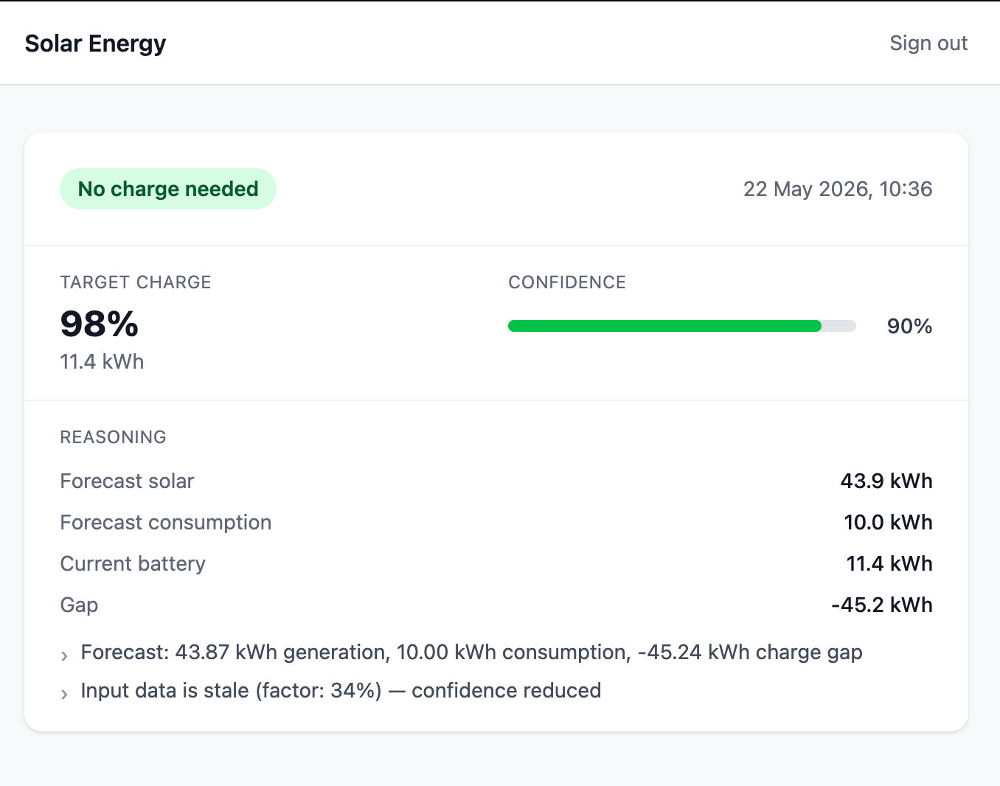

# Solar Energy Optimisation

An internet-facing solar battery charging optimisation service for a residential installation. It collects live data from external APIs on a schedule, stores it locally, and serves real-time charge recommendations to authenticated users via a React dashboard.

**Installation:** SolaX X1-HYBRID-6.0-D (6kW) inverter · 2× SolaX T-BAT H 5.8 (11.6kWh total, 8.1kWh usable) · 19 panels / 7.6kWp

### Dashboard



### Example API response

```json
{
  "data": {
    "action": "DO_NOT_CHARGE",
    "target_charge_pct": 98,
    "target_charge_kwh": 11.37,
    "confidence": 0.9,
    "reasoning": {
      "forecast_generation_kwh": 43.867,
      "forecast_consumption_kwh": 10,
      "current_battery_kwh": 11.37,
      "gap_kwh": -45.237,
      "factors": [
        "Forecast: 43.87 kWh generation, 10.00 kWh consumption, -45.24 kWh charge gap",
        "Input data is stale (factor: 34%) — confidence reduced"
      ]
    },
    "generated_at": "2026-05-22T08:54:39+00:00",
    "valid_until": "2026-05-22T16:54:39+00:00"
  }
}
```

---

## Architecture

```
energy-ui  (React SPA)
    │
    │  HTTP  (Sanctum token auth)
    ▼
energy-bff  (Laravel — aggregation + auth only, no business logic)
    │
    │  HTTP
    ▼
energy-service  (Laravel — optimisation engine, scheduled data collection)
    │
    ├── SolaxCloud API      (battery state — fetched every 15 min by worker)
    ├── Octopus Energy API  (consumption history — fetched hourly by worker)
    └── Open-Meteo API      (solar radiation forecast — fetched daily by worker)

worker  (Laravel queue worker + scheduler — runs inside energy-service codebase)
    ├── FetchBatteryStateJob   → every 15 minutes → battery_readings table
    ├── FetchSolarForecastJob  → daily at 06:00   → solar_forecasts table
    └── FetchConsumptionJob    → every hour       → consumption_readings table
```

**Key rule:** External APIs are never called during a web request. The recommendation engine reads from the database only. The worker collects data independently in the background.

**Frontend rule:** The UI never talks to energy-service directly. All traffic goes through the BFF.

---

## Services and Ports

| Service        | Description                              | Local Port |
|----------------|------------------------------------------|------------|
| energy-service | Optimisation engine + REST API           | 8001       |
| energy-bff     | Backend for Frontend (auth + aggregation)| 8002       |
| energy-ui      | React SPA (Vite dev server)              | 3000       |
| worker         | Queue worker + scheduler (no HTTP port)  | —          |
| MySQL 8        | Databases (energy_service, energy_bff)   | 3307       |
| Redis 7        | Cache and job queue                      | 6379       |

---

## Getting Started

### Prerequisites

- Docker Desktop ≥ 4.x
- Docker Compose v2

### 1. Clone and copy environment files

```bash
git clone <repo-url> HouseBatteryCalculator
cd HouseBatteryCalculator
cp .env.example .env
cp energy-bff/.env.example energy-bff/.env
```

Edit the **root `.env`** and fill in your API credentials:

| Variable | Where to find it |
|---|---|
| `SOLAX_TOKEN_ID` | SolaxCloud portal → Service → API → Token Management |
| `SOLAX_WIFI_SN` | Wi-Fi dongle label (the dongle SN, not the inverter SN) |
| `OCTOPUS_API_KEY` | octopus.energy/dashboard/developer |
| `OCTOPUS_ACCOUNT_NUMBER` | Your Octopus account page |
| `OCTOPUS_MPAN` | Your electricity meter (on bill or account page) |
| `OCTOPUS_SERIAL_NUMBER` | Your smart meter serial (on bill or account page) |

The `energy-bff/.env` file controls auth and does not need secrets — just an app key (generated in the next step).

### 2. Build and start

```bash
make build
```

Builds all images, starts all containers, and runs `composer install` inside the PHP containers. MySQL initialises both databases on first boot.

### 3. Generate the BFF app key

```bash
make key-bff
```

This writes a fresh `APP_KEY` directly into `energy-bff/.env`. Only needed once on a fresh install.

### 4. Run migrations

```bash
make migrate
```

### 5. Create your user account

```bash
make user EMAIL=you@example.com PASSWORD=yourpassword NAME="Your Name"
```

`NAME` defaults to `Admin` if omitted. The command is idempotent — safe to re-run.

### 6. Open the dashboard

Visit [http://localhost:3000](http://localhost:3000).

The worker begins collecting data immediately on startup. Battery state appears within 15 minutes; the solar forecast appears after 06:00 the next morning; consumption history is backfilled from Octopus over the first hourly run.

---

## Common Commands

```bash
# Stack
make up              # Start all containers (no rebuild, data preserved)
make down            # Stop all containers (data preserved in volumes)
make down-clean      # Stop and delete all volumes — full wipe, use with care
make build           # Rebuild images, start, and run composer install
make restart         # Restart all containers
make logs            # Tail all container logs
make worker-logs     # Tail only the worker (data collection + scheduler)
make ps              # Show container status

# Database
make migrate         # Run pending migrations on both services
make fresh           # Drop and re-migrate both databases (dev only)

# Setup (first-run only)
make key-bff         # Generate and write APP_KEY into energy-bff/.env
make user EMAIL=you@example.com PASSWORD=secret NAME="Your Name"

# Tests
make test            # Run all test suites (energy-service, energy-bff, energy-ui)

# Data collection — trigger immediately rather than waiting for the scheduler
make fetch-battery      # Dispatch FetchBatteryStateJob now
make fetch-forecast     # Dispatch FetchSolarForecastJob now
make fetch-consumption  # Dispatch FetchConsumptionJob now
make fetch-all          # Dispatch all three at once
```

---

## Running Tests

```bash
# All suites at once
make test

# Individual
docker compose exec energy-service php artisan test
docker compose exec energy-bff     php artisan test
docker compose exec energy-ui      npm run test
docker compose exec energy-ui      npm run type-check
```

---

## Directory Structure

```
HouseBatteryCalculator/
├── .env.example              # Template — copy to .env and fill in secrets
├── docker-compose.yml        # All services defined here
├── Makefile                  # Common commands (up, down, migrate, test, etc.)
├── docker/
│   └── mysql/init.sql        # Creates energy_service + energy_bff databases
├── energy-service/           # Optimisation engine (Laravel 12, PHP 8.5)
│   ├── app/
│   │   ├── Actions/          # Pure business logic (CalculateChargeRecommendationAction)
│   │   ├── DTOs/             # Typed data transfer objects (spatie/laravel-data)
│   │   ├── Enums/            # PHP 8.1 backed enums
│   │   ├── Jobs/             # Scheduled data-collection jobs
│   │   ├── Models/           # Eloquent models (thin — repositories own logic)
│   │   ├── Repositories/     # DB read/write behind interfaces
│   │   ├── Services/         # External API clients (behind interfaces)
│   │   └── Http/Controllers/ # API endpoints
│   ├── database/migrations/  # battery_readings, solar_forecasts, consumption_readings
│   └── routes/
│       ├── api.php           # GET /api/v1/recommendation
│       └── console.php       # Scheduled job definitions
├── energy-bff/               # Backend for Frontend (Laravel 12, PHP 8.5)
│   └── ...                   # Auth, proxy to energy-service
└── energy-ui/                # React 18 SPA (TypeScript strict, Vite 5, Tailwind CSS v4)
    └── src/
        ├── api/              # Typed BFF client
        ├── features/         # Co-located feature modules (auth, dashboard)
        └── hooks/            # Custom hooks (logic lives here, not in components)
```

---

## Key Design Decisions

- **Data collection is decoupled from web requests.** The `worker` container runs scheduled jobs that fetch from external APIs and store results in the database. The recommendation controller reads from the database only — no external calls on the request path.
- **Conservative by default.** If data is missing or stale, the system recommends charging to ceiling. A missed solar day costs ~£0.50; a flat battery is worse.
- **Solar generation derived from Open-Meteo.** We use `shortwave_radiation_sum` (MJ/m²) × total kWp × performance ratio (0.78) to estimate daily generation. No Forecast.solar rate limits in production.
- **Battery charge ceiling is 70%** (`BATTERY_CHARGE_CEILING_PCT`). Longevity decision — always a named constant, never a magic number.
- **Versioned API from day one.** All endpoints are under `/api/v1/`.
- **No cross-service database access.** Each service owns its own database schema entirely.

---

## Tariff

Intelligent Octopus Go:

| Period | Time | Rate |
|--------|------|------|
| Cheap | 23:30–05:30 | ~7.5p/kWh |
| Day | 05:30–23:30 | ~24p/kWh |

Rates are configuration values (`OCTOPUS_CHEAP_RATE_PENCE`, `OCTOPUS_DAY_RATE_PENCE`), never hardcoded.
